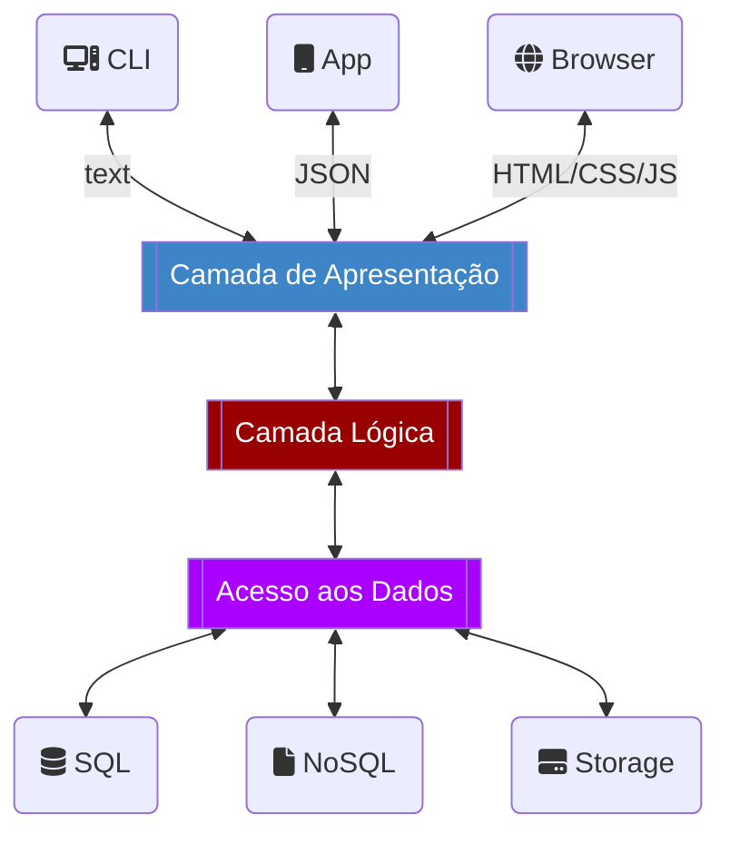
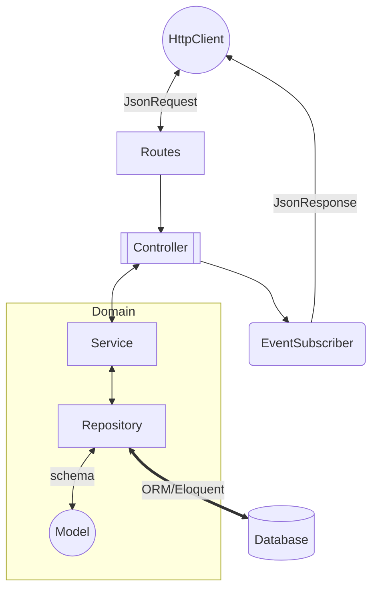

## Decisões Técnicas

### Arquitetura e System Design
Todo o design das camadas da aplicação foram pensados de acordo com as boas práticas do ecossistema web, através da interpretação do autor (@alessandrofeitoza) sobre "Arquitetura Hexagonal", "DDD", "entre outras coisas"

##### Arquitetura em Camadas
A arquitetura definida será baseada em camadas, dando uma melhor proposta de escalabilidade para a aplicação, como demonstra a figura a seguir:

> **Obs:** No diagrama abaixo teremos uma visão a longo prazo da aplicação, porém, para esta utilizaremos como camada de apresentação o JSON, ou seja, uma API REST.
> E para o acesso aos dados, utilizaremos prioritariamente um banco de dados SQL Relacional.

##### Arquitetura Hexagonal / Domain-drive Design

**Definição das Camadas**

O fluxograma acima demonstra a forma como as camadas vão servir a aplicação.

- **Repository:** Camada responsável por definir o acesso ao banco, embora o projeto seja Laravel, a ideia aqui é centralizar todo o acesso aos dados nessa camada;
- **Service:** Camada responsável pela lógica de negócio, calculos, e outras coisas especificas do "coração do software";
- **Controller:** Camada responsável por utilizar o "Service" para fins de entrada e saída dos dados, através de JSON Requests e Responses;
- **Model:** Por se tratar de Eloquent, a abordagem usada aqui é "ActiveRecord", ou seja, modelar os dados do banco apartir de classes do PHP;

> **Obs:** O "Dominio" está bem definido, sendo apenas "Model", "Repository" e "Service" as principais camadas nesse setor.

